# Analysis Platform Cloud

```plaintext
Analysis Platform Cloud is a minor changed version of  
Analysis Platform + DN7 (https://github.com/apdn7/AnalysisPlatform) to operate on Linux.  
For Windows/Windows Server, please use the original Analysis Platform + DN7.
```

Analysis Platform + DN7 (AP+DN7) is an open source web application to import, connect and visualize factory IoT data. It helps to collect, link and integrate data from multiple data sources.
Visualizations include Digital Native QC7 Tools (DN7), which is designed especially suitable for data on manufacturing domain.
Let's try data-driven process improvement by utilizing the data sleeping in the field.

<table border="0">
<tr>
<td>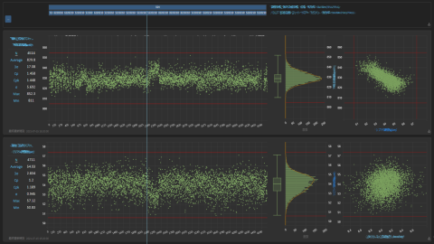</td>
<td>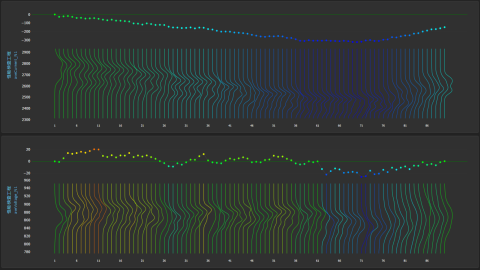</td>
<td>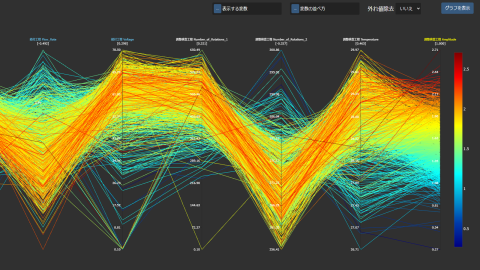</td>
</tr>
<tr>
<td>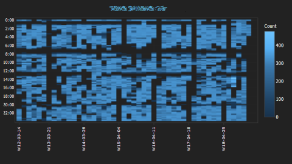</td>
<td>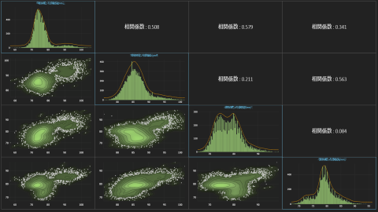</td>
<td>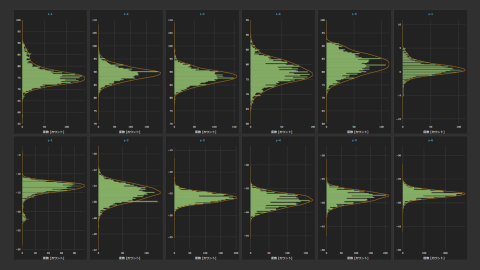</td>
</tr>
<tr>
<td>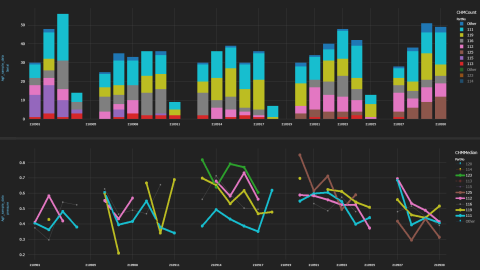</td>
<td>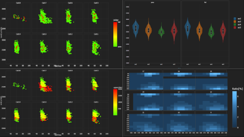</td>
<td>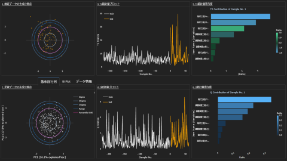</td>
</tr>
<tr>
<td>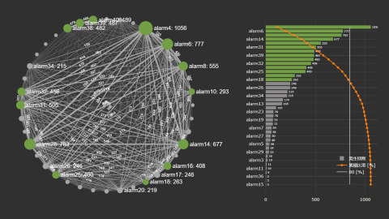</td>
<td>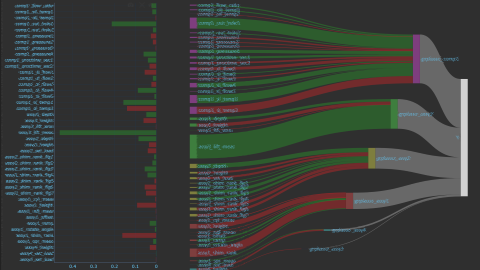</td>
<td>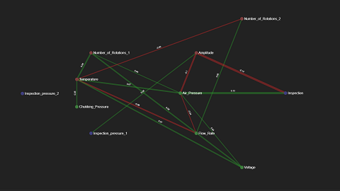</td>
</tr>
</table>

## What can we do with the Analysis Platform?

The main activities that user can take with the Analysis Platform are:

* Check behavior of time-series or id-series data, stratify across processes (Full Points Plot)
* Check behavior of fluctuation of the distribution (Ridgeline Plot)
* Check correlation between variables and clusters in distribution (Multiple Scatter Plot)
* Check behavior of each category/group (Stratified Plot)
* Check behavior of related to human activities & process and product behavior (Calendar Heatmap)
* Look for key variables that strongly relates to output (Sankey Diagram)
* Grasp phenomenon that occurs at the same time (Cooccurrence Graph)
* \+ many other useful visualizations

The Analysis Platform currently supports following data sources:  

* MySQL
* PostgreSQL
* SQL Server
* Oracle Database

## Terms of Use

On your first access to the application, you must read and agree to [Terms of Use](/about/terms_of_use_en.md) shown on modal screen.  

## Requirements

AP+DN7 Cloud is tested under the following condition:

* Ubuntu 24.04.2 LTS x86_64
* Intel i7-9700 (8) @ 4.700GHz
* 32GB RAM
* 512GB SSD
* Web browser: Microsoft Edge 134.0.3124.66 (Official Build)

## Getting Started

Docker and Docker Compose must be installed and running.  
For detailed instruction, please refer below documents (PDF):

* [Getting Started](https://github.com/user-attachments/files/19566945/AP%2BDN7Cloud_GettingStarted_470_en.pdf)

First, clone the repository:

```shell
git clone https://github.com/apdn7/AnalysisPlatformCloud.git
cd AnalysisPlatformCloud
```

Then, activate the application by docker compose up:

```shell
sudo docker compose up
```

```plaintext
Note:
If you are connecting the internet using proxy server, 
you must edit ".env" file and specify the appropriate address in advance.
```

AP+DN7 Cloud is activated after all downloads are finished.  
AP+DN7 Cloud uses Port 7770 by default.  
Open below URL to access the application.

```plaintext
http://localhost:7770/
```

## How do we shut down AP+DN7 Cloud?

To shut down AP+DN7 Cloud, run docker compose stop command:

```shell
sudo docker compose stop
```

## Uninstall

To uninstall AP+DN7 Cloud, you can simply remove all the files and the installed Docker images.  
Environment variables are not changed during the installation of AP+DN7 Cloud.  
You will need administrative privileges to delete the directory as it contains  
mounted data created by Docker inside the AP+DN7 Cloud directory.

## Is there any sample data that we can use?

By default, the Analysis Platform contains sample data and corresponding settings to get an overview of each visualization.  
Data is stored as TSV file under the subdirectories in [/sample_data](/sample_data):

* /assembly: Quality data
  * /1_parts_feed
    * 20220228.tsv
  * /2_inspection
    * 20220228.tsv
* /parts_processing: Machine data
  * /1_machine_parameter_a
    * 20220311.tsv
  * /2_machine_parameter_b
    * 20220311.tsv
  * /3_finishing
    * 20220311.tsv
* /COG_sample_data: Occurence of machine alarms
  * alarm_every_15minutes.tsv
  * alarm_daily.tsv
* /AgP_sample_data: PartNo, Ok/NG, NG_Mode, and pressure data
  * AgP_sample.tsv

Above data will be automatically imported after activation.  
You can call each sample visualization from 'Load' or 'Bookmark' on upper right corner of GUI.

If you do not need those data, you can just remove each data source setting from GUI.

## License

* The Analysis Platform Cloud is released under MIT License. See our [LICENSE](LICENSE.md) for more detail.
